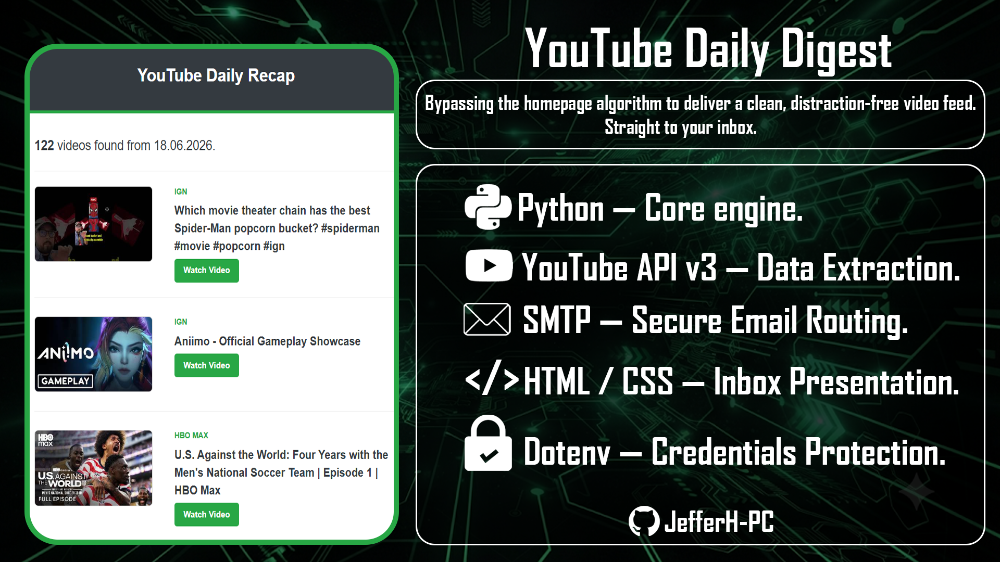

# YouTube Daily Recap

A Python script that automatically fetches videos uploaded yesterday from a list of YouTube channels and sends a beautiful HTML email digest.



---

## 📋 Table of Contents

- [Overview](#overview)
- [Features](#features)
- [Prerequisites](#prerequisites)
- [Installation](#installation)
- [Configuration](#configuration)
- [Customization](#customization)
- [Troubleshooting](#troubleshooting)
- [License](#license)

---

## Overview

**YouTube Daily Recap** is a Python automation tool that:
- Reads a list of YouTube channel IDs from `channels.txt`.
- Fetches all videos uploaded by those channels on the **previous day**.
- Compiles them into a clean, responsive HTML email.
- Sends the email via Gmail’s SMTP server (or any SMTP provider).

This is perfect for content curators, marketers, or anyone who wants a daily digest of new videos from their favorite creators.

---

## Features

✅ **Automated daily run** – schedule with cron or Task Scheduler.  
✅ **YouTube Data API v3** – fetches channel uploads efficiently.  
✅ **Duplicate prevention** – ensures each video appears only once.  
✅ **Rich HTML email** – includes thumbnails, titles, channel names, and “Watch Video” buttons.  
✅ **Plain text fallback** – for email clients that don’t support HTML.  
✅ **Environment variables** – secure storage for API keys and credentials.  
✅ **Error handling** – gracefully handles missing channels or API errors.

---

## Prerequisites

Before you begin, ensure you have the following:

- **Python 3.7+** installed on your system.
- A **Google Cloud Project** with the **YouTube Data API v3** enabled and an **API key**.
- A **Gmail account** (or any SMTP server) for sending emails.
- **Less secure app access** turned **ON** for Gmail (or use an App Password if 2FA is enabled).

---

## Installation

1. **Clone this repository:**
   ```bash
   git clone https://github.com/JefferH-PC/yt_recap_bot.git
2. **Install required Python packages:**
   ```bash
   pip install google-api-python-client
3. **Update "channels.txt" with the channels you want.**
4. **Set up environment variables**

---

## Configuration

### 1. YouTube API Key
- Go to [Google Cloud Console](https://console.cloud.google.com/).
- Create a new project (or select an existing one).
- Enable **YouTube Data API v3**.
- Create an **API key** and restrict it to the YouTube API.
- Copy the key.

### 2. Email Credentials
- Use a Gmail account (or any SMTP server that supports SSL).
- If you use **2‑Factor Authentication**, generate an **App Password**.
- For plain Gmail without 2FA, enable **“Allow less secure apps”** (not recommended).

### 3. Environment Variables
Set the following environment variables in your shell or in a `.env` file (if you use `python-dotenv`):

| Variable          | Description                                   |
|-------------------|-----------------------------------------------|
| `YOUTUBE_API_KEY` | Your YouTube Data API v3 key.                 |
| `EMAIL_USER`      | The email address used to send the digest.    |
| `EMAIL_PASS`      | The password or app password for that email.  |
| `RECIPIENT_EMAIL` | The email address to receive the digest (optional; if not set, it defaults to `EMAIL_USER`). |

---

## Customization

### Email Subject & Content
- To change the email subject, modify the `msg['Subject']` line in the `send_email()` function.
- The HTML template is embedded directly in the script. You can edit the `html_content` variable to change colors, fonts, or layout.

### Time Zone
The script uses the system’s local time to determine “yesterday”. If you want a specific timezone, modify the `get_date_bounds()` function using `pytz`.

### Add More Channels Dynamically
You can edit `channels.txt` at any time; the script reads it fresh on each run.

### Support for Other SMTP Providers
Replace the SMTP server and port in the `send_email()` function.

---

## Troubleshooting

| Issue | Possible Solution |
|-------|-------------------|
| **`channels.txt not found`** | Ensure the file exists in the same directory as `main.py`. |
| **No videos found** | Check that the channels have uploaded videos yesterday. Also verify the channel IDs are correct. |
| **`API key invalid`** | Make sure the `YOUTUBE_API_KEY` environment variable is set and the API is enabled. |
| **Email not sent** | Check your email credentials; if using Gmail, ensure “Allow less secure apps” is **ON** or use an App Password. |
| **`SMTPAuthenticationError`** | Double‑check your email password/app password. |
| **Rate limiting** | The script uses pagination and respects quota; if you exceed the daily quota, wait until the next day. |

For detailed error logs, run the script from the terminal to see print statements.

---

## License

**You are free to:**
- Use, copy, modify or merge. 
- Use it in commercial projects.
- Do so with **no royalty or fee**.

**However:**
- **No warranty** – the software is provided "as is", without warranty of any kind, express or implied, including but not limited to the warranties of merchantability, fitness for a particular purpose, and noninfringement.
- **No liability** – in no event shall the authors or copyright holders be liable for any claim, damages, or other liability arising from the software.

In short, you can do almost anything with this code, but you use it at your own risk.
